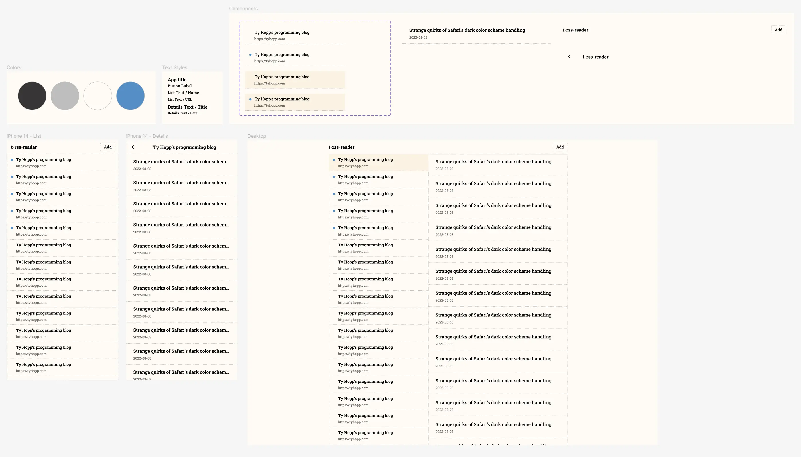

# t-rss-reader

A personal [RSS](https://en.wikipedia.org/wiki/RSS) reader you can self-host.

## Project

The project is arranged in three parts:

- [Backend infrastructure](./infra/README.md) built with Terraform and AWS. After setup you only need to run `make create` to build all cloud resources.
- Frontend clients that run natively on each platform:

  - Web ([Svelte](./web/svelte/README.md), Vue (TBD), React (TBD))
  - iOS (TBD)
  - macOS (TBD)
  - Windows (TBD)

- A [Figma design file](./design/README.md) that you can view or duplicate.

## Usage

1. Set up the [backend infrastructure](./infra/README.md). The output will show the invoke URLs for the endpoints.
2. Run one of the clients, such as the [Svelte](./web/svelte/README.md) client. Provide the invoke URLs as env vars for each client.
