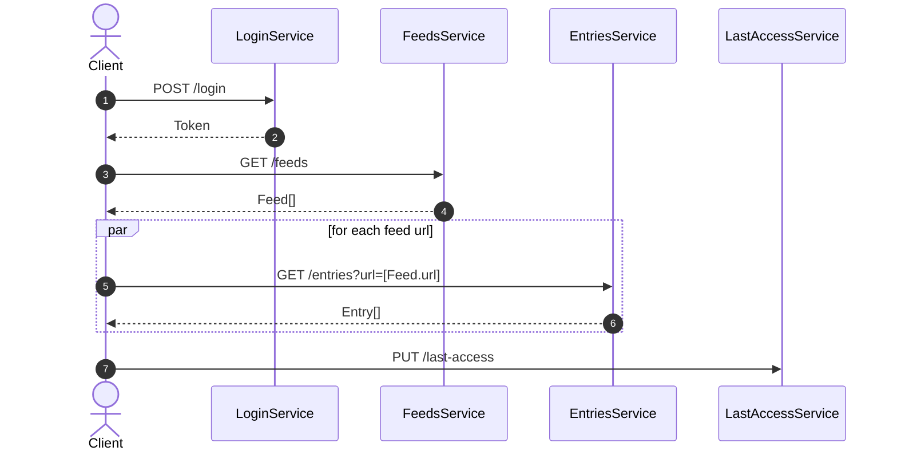
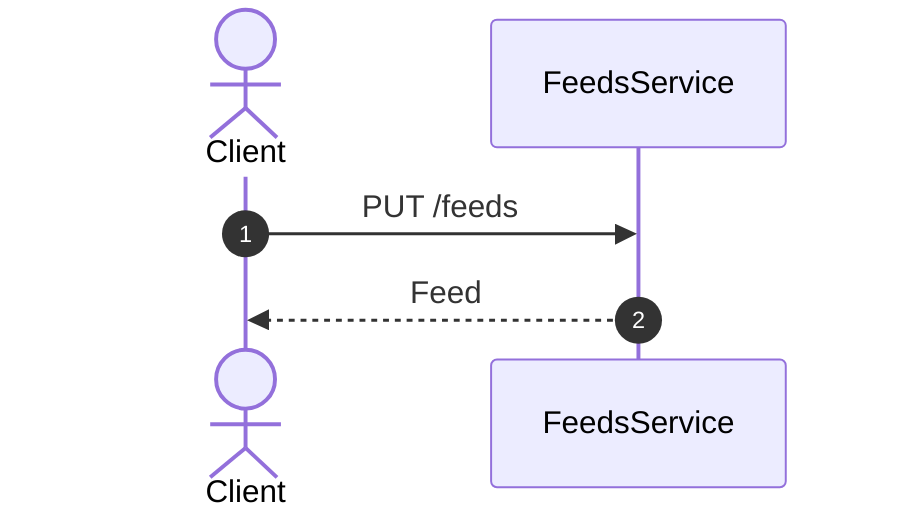
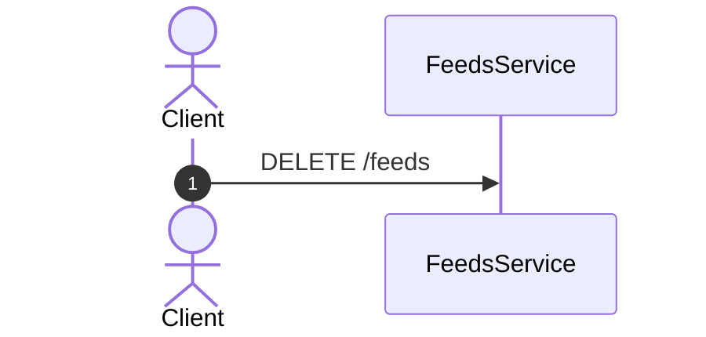

# Sequence

Sequence diagrams that describe the patterns every client implements.

## App start sequence



## Upsert feed sequence



## Delete feed sequence



## Type reference

```ts
interface Token {
  accessToken: string;
  tokenType: string;
  expiresIn: number;
}

interface Feed {
  name: string;
  url: string;
  hasNew?: boolean;
}

interface Entry {
  url?: string;
  title?: string;
  published?: string;
  isNew?: boolean;
}
```
